# NETWORKWALKS-B083-WK4-CYBERSECURITY-PENETRATION-TESTING-REPORT
## PENETRATION TESTING REPORT
### Mediroza General Hospital
### Web Application Security Assessment

**Prepared by**: Divine Oses-Oyedoh
**Organisation**: Networkwalks
**Batch**: B083 | Week 4 Capstone Project
**Target**: https://medirozahospital.com
**Classification**: Confidential

# 1. Executive Summary
I was assigned to conduct a black-box penetration test on the web infrastructure of Mediroza General Hospital at https://medirozahospital.com. The client provided written authorisation for this assessment. The goal was to identify vulnerabilities, demonstrate their real-world impact through controlled exploitation, and provide recommendations to improve the organisation's security posture.

During the assessment I identified seven vulnerabilities ranging from Low to Critical severity. The most significant finding was a SQL injection vulnerability on the patient portal login page, which allowed me to bypass authentication entirely without knowing any valid credentials. This access led to three confidential patient lab report PDFs. Separately, reconnaissance of the web server (supported by disallowed entries in robots.txt) revealed that directory listing was enabled on three restricted folders — /patient/, /staff/, and /old/ — none of which should have been browsable without authentication.

The /old/ folder exposed a forgotten database backup file in plain text, containing the monthly salaries, job titles, and national ID numbers of all 30 hospital employees, as well as the full shareholding structure of the hospital's 10 shareholders.

The overall security posture of the target is poor. Multiple critical vulnerabilities exist that would allow an unauthenticated attacker to access confidential patient data, staff financial and personal records, and corporate ownership information with minimal effort and no specialised equipment.

Overall Risk Rating: CRITICAL — Immediate remediation is recommended.

---

# 2. Scope and Methodology

### 2.1 Scope
The assessment was limited to the following target as agreed with the client.

*Target domain*: https://medirozahospital.com
The following were excluded from scope: social engineering, denial-of-service attacks, and any testing outside the agreed domain.

### 2.2 Methodology
I followed a structured black-box penetration testing methodology consisting of four phases.
●	Reconnaissance: passive and active information gathering (WHOIS, DNS, robots.txt, technology fingerprinting, directory enumeration).
●	Vulnerability Identification: analysing application behaviour to find weaknesses in authentication, access control, and input handling.
●	Exploitation: demonstrating the real impact of each vulnerability through controlled exploitation.
●	Documentation: recording all findings, evidence, and remediation recommendations in this report.

### 2.3 Tools Used
●	whatweb — web technology and server fingerprinting
●	Nikto — automated web server vulnerability and misconfiguration scanner
●	Burp Suite (Proxy, Repeater) — intercepting and manipulating HTTP requests
●	ffuf — directory and file brute-forcing
●	curl / wget — command-line HTTP requests and file retrieval
●	JTR (john Kali CLI) — inspecting and decrypting password-protected PDF files
●	John the Ripper / hashcat — password recovery tooling
●	exiftool — reading file metadata
●	Claude (AI assistant) — methodology guidance, troubleshooting, and converting raw SQL dump data into readable tables

---

# 3. Findings and Proof of Exploitation

### 3.1 Summary Table
| **\#** |	**Vulnerability**	| **Location**	| **Risk** |
| ------ | ----------------- | ------------ | -------- |
| 1	| Information disclosure via server/CMS banners	| Site-wide |	Low |
| 2 |	Directory listing enabled on restricted folders	| /patient/, /staff/, /old/ | Critical |
| 3	| Username enumeration on login page | patient/login.php	| Medium |
| 4	| SQL injection login bypass |	patient/login.php	| Critical |
| 5	| Confidential patient PDF reports accessible	| patient/ (portal) |	High |
| 6	| Weak/outdated PDF encryption, password recovery	| patient_report PDFs |	High |
| 7	| Exposed database backup with staff & shareholder data |	old/ (backup .sql file)	| Critical |

### 3.1 Finding 1 — Information Disclosure via Server/CMS Banners
Risk Rating: Low
Location: Site-wide
HTTP response headers and page metadata revealed the exact software stack in use, which narrows the search for known vulnerabilities and speeds up attacker reconnaissance.

Steps Taken
Running whatweb against the target returned the following:

Server: LiteSpeed
X-Powered-By: PHP/8.2.33
meta name="generator" content="Mediroza CMS 1.4.2"

The homepage itself returned HTTP 403 Forbidden, while these headers and tags were still disclosed, confirming the underlying stack without needing authenticated access.

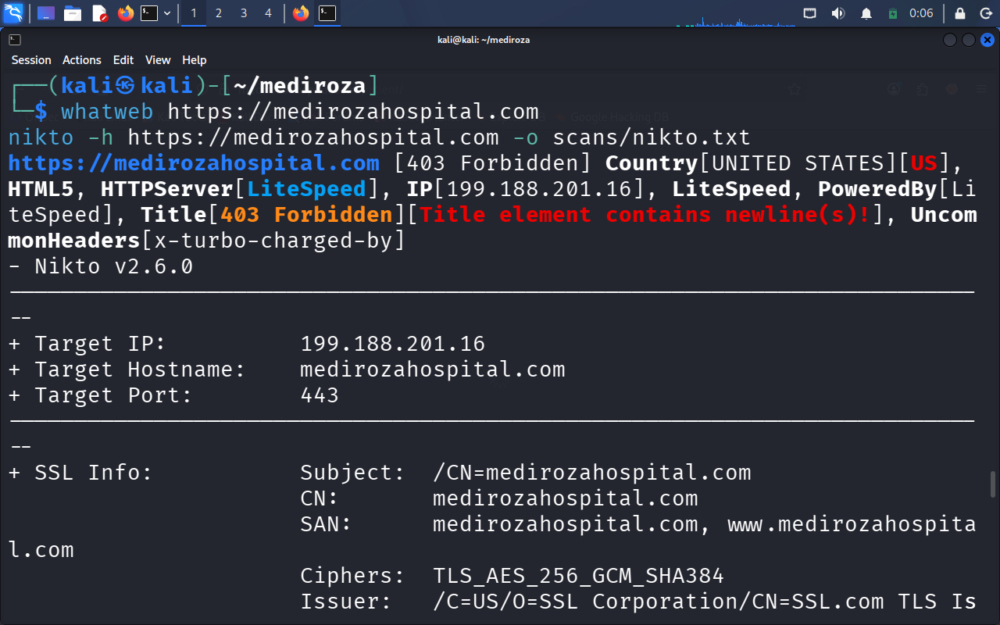

### 3.2 Finding 2 — Directory Listing Enabled on Restricted Folders

Risk Rating: Critical
Location: /patient/, /staff/, /old/
Directory listing is a web server misconfiguration that displays the full contents of a folder, like a file browser, when no index page exists and indexing has not been explicitly disabled. Three folders on the server were found to have this enabled, none of which should have been browsable without authentication.

Steps Taken
A Nikto scan against the target flagged the following:
+ [750500] /patient/: Directory indexing found.
+ [750500] /old/: Directory indexing found.
+ [750500] /staff/: Directory indexing found.
  
robots.txt was checked separately and was found to list /old/ as a disallowed path — the site owners had attempted to hide this folder from search engines, but it remained fully accessible and browsable to a direct visitor.

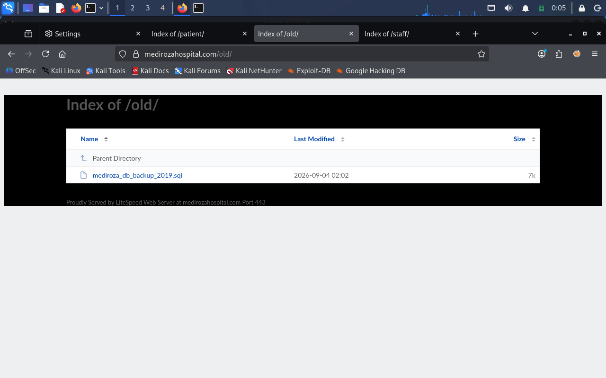

### 3.3 Finding 3 — Username Enumeration on Login Page

Risk Rating: Medium
Location: patient/login.php
Username enumeration occurs when a login page reveals whether a username exists by returning a different message for an invalid username than for a valid username with an incorrect password. A secure login should always return the same generic message for both cases.

### Steps Taken
Testing the login form with an assumed non-existent username returned an explicit message confirming the account did not exist:

username: bob
password: admin

RESPONSE: "Username not found"

Because the application discloses this distinction, an attacker can enumerate valid accounts prior to a credential-stuffing or brute-force attempt, narrowing the attack surface considerably.

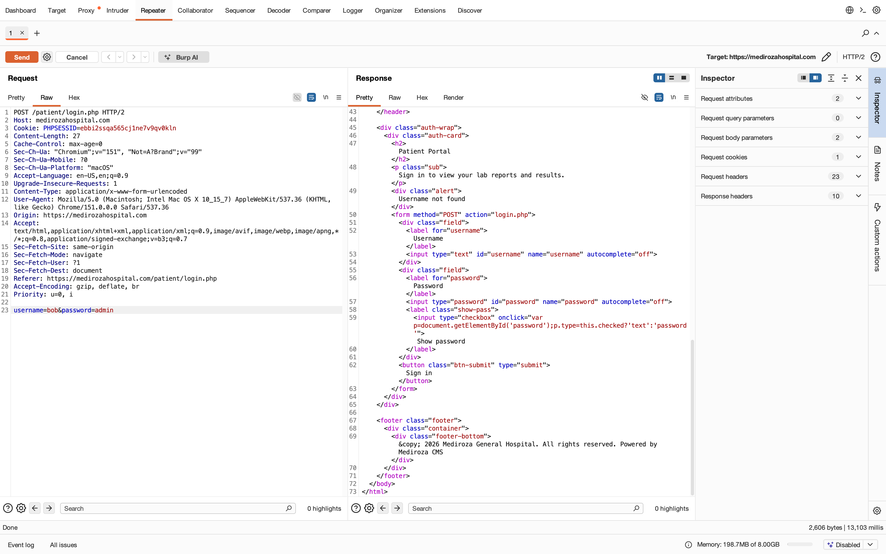
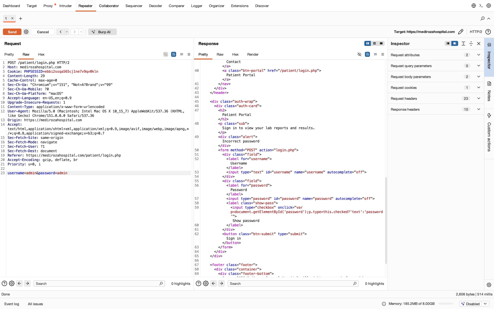

### 3.4 Finding 4 — SQL Injection — Authentication Bypass

Risk Rating: Critical
Location: patient/login.php
SQL injection occurs when an application places user input directly inside a database query without properly sanitising or parameterising it. An attacker can insert SQL syntax into an input field to change the query's behaviour. In this case, the password check on the login form could be bypassed entirely without knowing any valid credentials.

### Steps Taken

A single quote was submitted in the username field to test for injectable input:

username: admin' OR '1'='1
password: admin

The response disclosed a raw MySQL syntax error, confirming the input reaches the database query unsanitised:

Warning: mysqli_query(): You have an error in your SQL syntax; check the
manual that corresponds to your MySQL server version for the right syntax
to use near '\' OR \'1\'=\'1' at line 1

A comment-based payload was then used to bypass the password check entirely:

username: admin'-- -
password: anything

The -- sequence comments out the remainder of the query, so the application's underlying query effectively reduces to a check on the username alone, with no password validation performed. The response confirmed a successful bypass:

HTTP/2 302 Found
Location: portal.php

This is an unauthenticated, pre-authentication vulnerability requiring no valid credentials of any kind, and is the single most severe finding in this assessment.

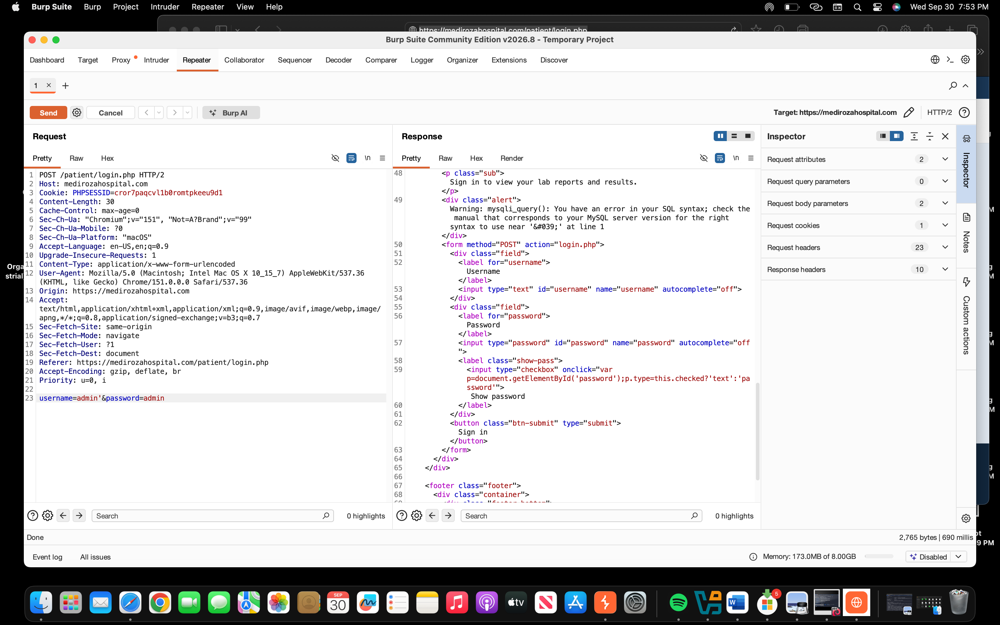
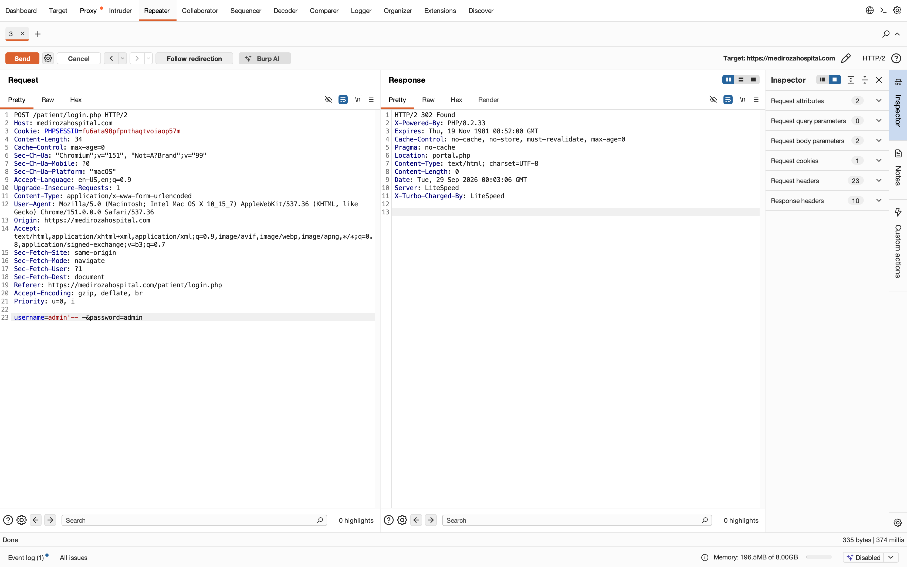

### 3.5 Finding 5 — Confidential Patient PDF Reports Accessible

Risk Rating: High
Location: patient/ (portal)
After bypassing authentication, the patient portal exposed downloadable lab report PDFs belonging to patients, which should only be accessible to the named patient and their treating doctor.

### Steps Taken
Following the SQL injection bypass, the portal page listed downloadable report files, which were retrieved directly

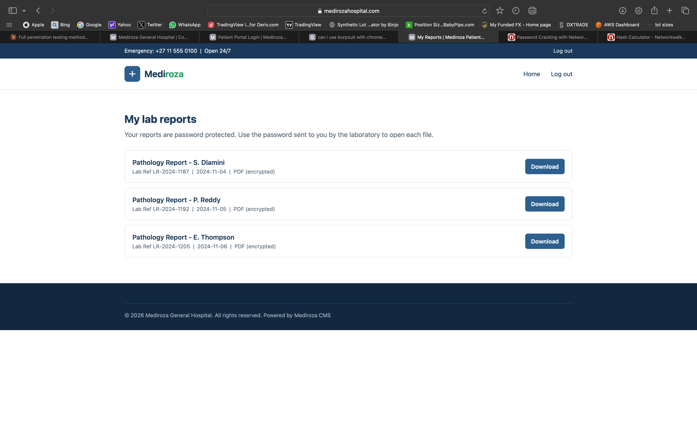

### 3.6 Finding 6 — Weak / Outdated PDF Encryption

Risk Rating: High
Location: patient_report PDFs
The retrieved PDF files were password-protected using PDF encryption revision 3 (RC4, 128-bit) — a legacy encryption standard that is feasible to attack offline using modern password-cracking tools, particularly where the underlying password is weak or guessable.

### Steps Taken
I used the Networkwalks Hash Calculator to extract a crackable hash from each PDF, then ran each hash through the Networkwalks Password Cracker. 

Reports 1 and 2 cracked immediately using the built-in 100 word default wordlist.

RESULTS 

patient_report_1.pdf – 123456
patient_report_2.pdf - password

Report 3 did not crack with the built-in list. I switched to a larger wordlist (JTR default password list) and ran the attack again. 

patient_report_3.pdf – !@#$%^

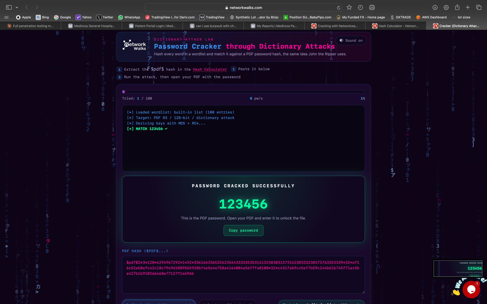
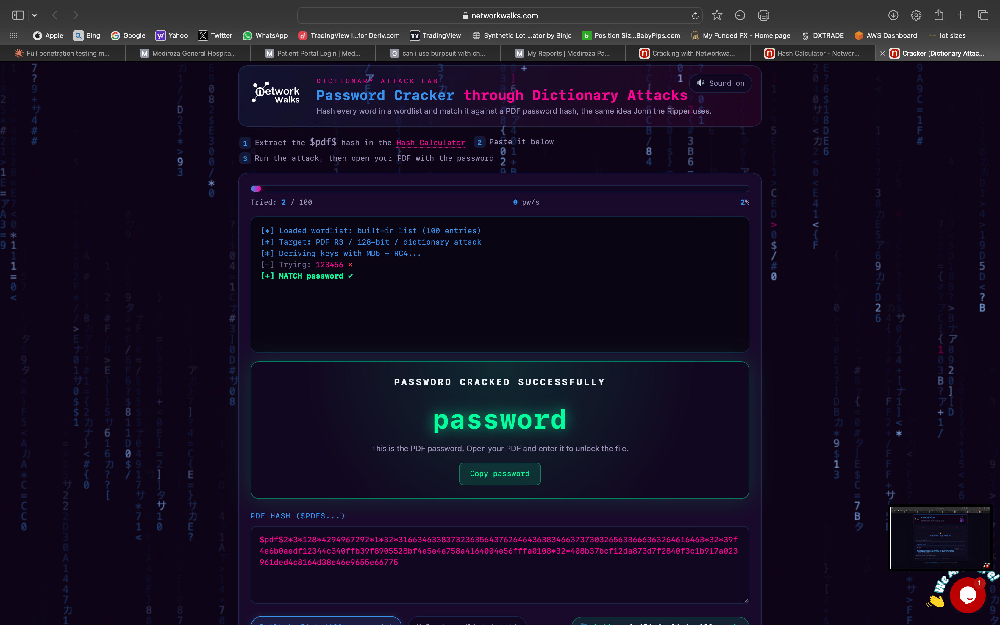

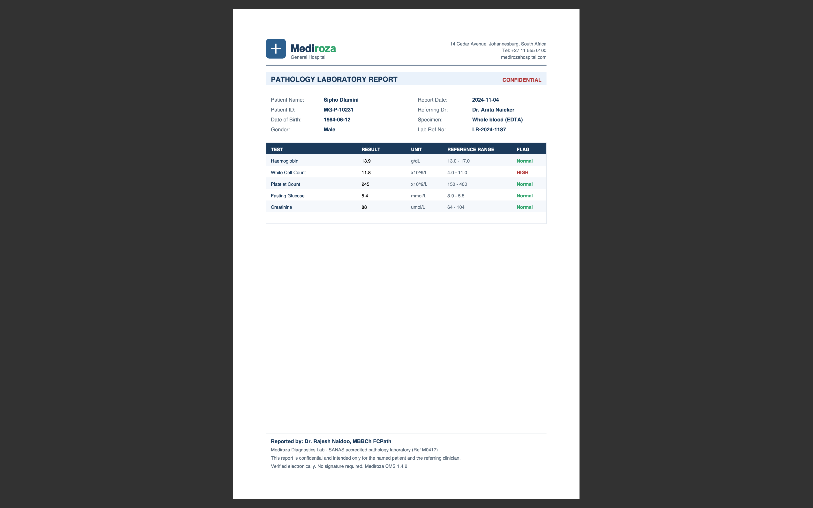
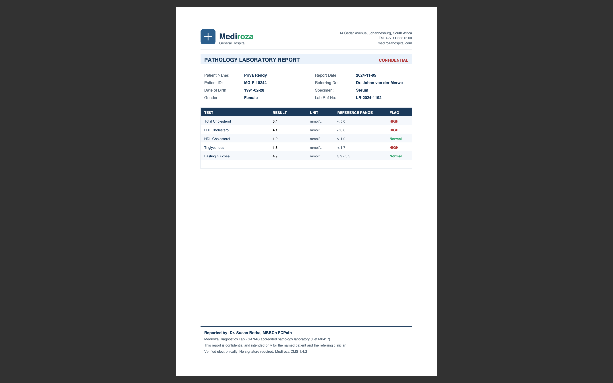
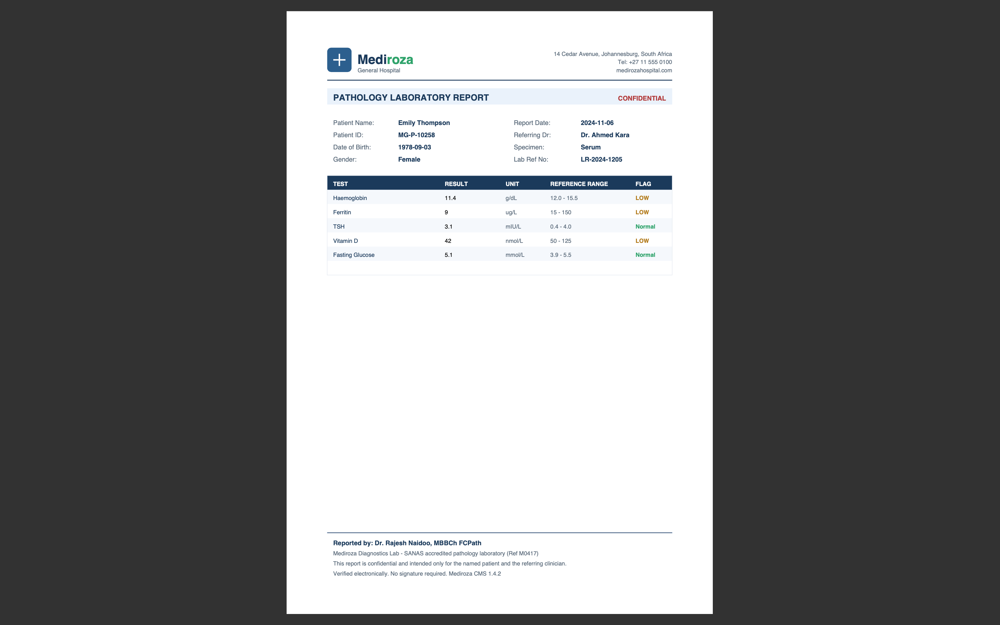

### 3.7 Finding 7 — Exposed Database Backup — Staff Salaries and Shareholder Data

Risk Rating: Critical
Location: old/ (backup .sql file)

The /old/ directory, already confirmed browsable in Finding 2 and referenced in robots.txt, contained a forgotten MySQL backup file in plain, unencrypted SQL format. This backup contained two complete database tables: full staff records for all 30 hospital employees (including national ID numbers and salaries) and the complete shareholder register for the hospital's 10 shareholders.

Steps Taken

The backup file was located directly in the open /old/ directory listing and downloaded:

wget https://medirozahospital.com/old/mediroza_db_backup_2019.sql

The file was opened as plain text and the staff and shareholders INSERT statements were extracted and converted into readable tables for analysis and reporting.

### Staff Table (30 records) — Name, Job Title, Department, Monthly Salary (ZAR)

| **\#** |	**Full Name** |	**Job Title** |	**Department** |	**Salary (ZAR)** |
| ------ | ------------- | ------------- | -------------- | ---------------- |
| 1	| Dr. Rajesh Naidoo |	Chief Pathologist	| Diagnostics Lab	| 138,000 | 
| 2 | Sarah Botha	Chief | Financial Officer	 | Finance |	152,000 |
| 3 |	Dr. Johan van der Merwe | Medical Director |	Management |	160,000 |
| 4 |	Dr. Anita Naicker |	Consultant Cardiologist |	Cardiology |	132,000 |
| 5 |	Dr. Ahmed Kara |	Consultant Physician |	Internal Medicine |	128,000 |
| 6 |	Dr. Yusuf Cassim |	Senior Registrar |	Emergency & Trauma |	74,000 |
| 7 | Michael Roberts	| HR Director	| Human Resources |	96,000 |
| 8 |	Susan Pretorius	| HR Officer	| Human Resources |	32,000 |
| 9 |	Jameel Malik	| IT Systems Administrator |	IT |	58,000 |
| 10 | Thabo Molefe	| Network Engineer |	IT	| 46,000 |
| 11 |	Nomvula Khumalo	| Registered Nurse |	Emergency & Trauma |	34,000 |
| 12 |	Lerato Mokoena	| Registered Nurse |	Pediatrics | 33,000 |
| 13 |	Bongani Ndlovu	| Registered Nurse |	Cardiology |	35,000 |
| 14 |	Zanele Mahlangu	| Nursing Sister |	Theatre	| 42,000 |
| 15 |	Kagiso Sithole | Pharmacist	| Pharmacy |	61,000 |
| 16 | Naledi Zulu	| Pharmacy Assistant	| Pharmacy |	26,000 |
| 17 |	Themba Nkosi | Radiographer |	Radiology | 44,000 |
| 18 |	Palesa Radebe	| Radiographer |	Radiology |	43,000 |
| 19 | Deepak Pillay |	Lab Technologist	| Diagnostics Lab |	41,000 |
| 20 |	Kavitha Govender |	Lab Technician |	Diagnostics Lab |	35,000 |
| 21 |	Dr. Suresh Moodley |	Consultant Radiologist |	Radiology |	130,000 |
| 22 |	Dr. Fatima Patel |	Pediatrician | Pediatrics |	118,000 |
| 23 |	Nisha Singh |	Physiotherapist |	Rehabilitation |	48,000 |
| 24 |	Dr. Vikram Chetty	| Anaesthetist |	Theatre |	135,000 |
| 25. |	David Smith |	Facilities Manager |	Operations |	52,000 |
| 26 | Karen O'Connor |	Billing Administrator | Finance |	29,000 |
| 27 |	James Wilson |	Security Supervisor	| Operations |	27,000 |
| 28 |	Linda Fourie |	Receptionist	| Front Office |	19,000 |
| 29 |	Peter van Wyk	| Procurement Officer |	Supply Chain |	38,000 |
| 30 |	Andile Mbeki |	Ward Clerk |	Administration |	21,000 |

Note: the original backup also included personal email addresses, personal phone numbers, and South African national ID numbers for every employee, which are omitted from this table but present in the underlying evidence file. National ID numbers in particular represent a significant identity-theft risk and should be treated as highly sensitive PII in the impact assessment.

### Shareholders Table (10 records) — Name, Share %, Share Class

| **\#** |	**Shareholder Name** |	**Share %**  |	**Share Class** |
| ------ | -------------------- | ----------- | --------------- |
| 1 |	Dr. Rajesh Naidoo	| 18.0%	Ordinary
| 2	| Cedar Health Holdings (Pty)  Ltd | 15.0% |	Ordinary |
| 3	| Dr. Johan van der Merwe	| 12.0%	| Ordinary |
| 4	| Reddy Family Trust	| 11.0%	| Ordinary |
| 5	| Thabo Molefe	| 10.0% | Ordinary |
| 6	| Sarah Botha	| 9.0% | Ordinary |
| 7	| Dr. Ahmed Kara	| 8.0% | Preferential |
| 8	| Naledi Zulu	| 7.0%	| Ordinary |
| 9	| Michael Roberts	| 6.0% |	Ordinary |
| 10 |	Dr. Vikram Chetty	| 4.0% |	Preferential |

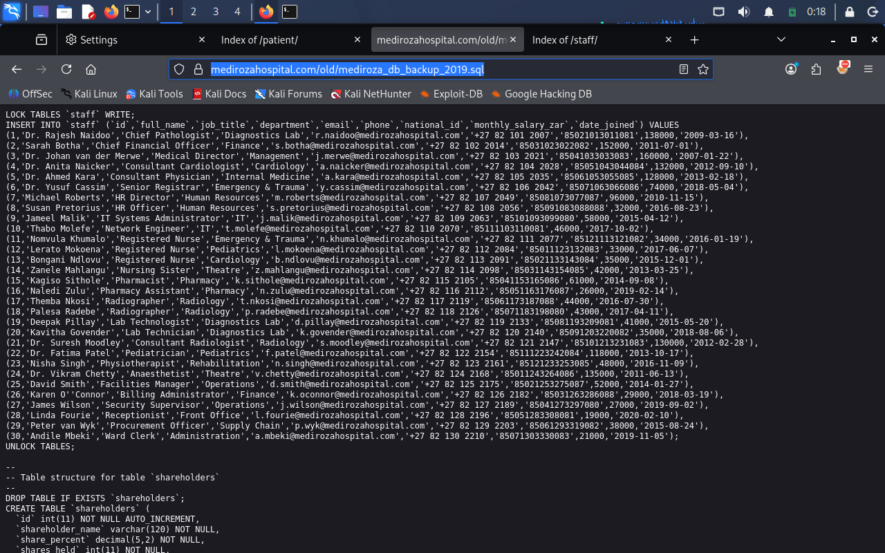

---

# 4. Full Attack Chain Summary

The following shows the complete, independent paths used to reach the confidential data, and how the findings relate to one another.

●	Step 1: robots.txt and a Nikto scan both identified /patient/, /staff/, and /old/ as accessible, indexed directories on the server. (Finding 2)
●	Step 2: the patient login page returned a distinct "Username not found" message for an invalid username, confirming a username enumeration weakness. (Finding 3)
●	Step 3: a single quote in the username field triggered a raw MySQL syntax error, confirming the field was vulnerable to SQL injection. (Finding 4)
●	Step 4: the payload admin'-- - bypassed the login entirely, returning a 302 redirect into the authenticated patient portal with no valid credentials. (Finding 4)
●	Step 5: the portal exposed downloadable patient lab report PDFs, which were retrieved. (Finding 5)
●	Step 6: the PDFs used outdated RC4-128 encryption; password recovery was attempted against the files directly. (Finding 6)
●	Step 7: independently of the login bypass, the open directory listing on /old/ (Finding 2) exposed a forgotten database backup file. (Finding 7)
●	Step 8: the backup contained the salaries, personal details, and national ID numbers of all 30 staff, and the full shareholding structure of the hospital's 10 shareholders in plain text. (Finding 7)

Note: unlike a scenario where the backup location is discovered only via a metadata clue inside a cracked PDF, in this assessment the /old/ directory was identified directly through reconnaissance (Nikto and robots.txt), independently of the PDF-cracking path. Both routes converge on the same underlying failure: sensitive files stored inside the public web root with no access control.

# 5. Recommendations and Remediation
   
### 5.1 Fix Directory Listing and Remove the Backup

Disable directory listing on all folders (Apache/LiteSpeed: add Options -Indexes, or the equivalent LiteSpeed directive, to the server configuration or .htaccess). Delete the database backup from /old/ immediately. Backups must never be stored inside the public web root — store them in a private, access-controlled location with no public HTTP exposure.

### 5.2 Fix SQL Injection

Replace the current login query with a parameterised query or prepared statement. This separates SQL code from user input so that no crafted input can alter the query structure. This is the single most important fix in this report.

// Safe example using PHP PDO prepared statement
$stmt = $pdo->prepare("SELECT * FROM users WHERE username = ? AND password = ?");
$stmt->execute([$username, $password]);

### 5.3 Fix Username Enumeration

Return a single generic message for any failed login attempt, regardless of whether the username or password was incorrect — for example: "Invalid username or password." Ensure response timing is also consistent between both failure cases.

### 5.4 Fix PDF Access and Password Strength
Move PDF files outside the web root so they cannot be served directly by the web server. Enforce access through a server-side script that checks authentication and authorisation before serving any file. Where password protection is still used, enforce AES-256 (PDF revision 6) rather than legacy RC4, and require a minimum password length of 12 characters with a mix of character types.

### 5.5 Suppress Version and Server Banners
Remove or suppress version-revealing headers (Server, X-Powered-By) at the server configuration level, and strip CMS generator meta tags from rendered HTML output. This does not replace patching, but slows attacker reconnaissance.

### 5.6 General
●	Apply least-privilege database accounts, so a single injection point cannot reach unrelated tables such as staff or shareholders.
●	Segment databases by business function (patient, HR, financial) with separate credentials.
●	Disable verbose SQL error output in production; log errors server-side only.
●	Given the scope of PII exposed (national ID numbers, health data), evaluate regulatory notification obligations under applicable data protection law (e.g. POPIA in South Africa) as part of incident response planning.

---

# 6. Conclusion
This assessment found multiple, independently exploitable paths from an unauthenticated starting position to highly sensitive internal data — patient medical records, full staff PII and payroll data, and confidential shareholder ownership information. No sophisticated tools or specialised knowledge were required to identify or exploit any of these findings. All vulnerabilities in this report are well-known, well-documented vulnerability classes with established, standard fixes. I recommend the client address all Critical and High findings immediately before this system is used to store or serve real patient data.

Submitted by: Divine Oses-Oyedoh
Organisation: Networkwalks
Batch: B083 | Week 4 Capstone Project.
